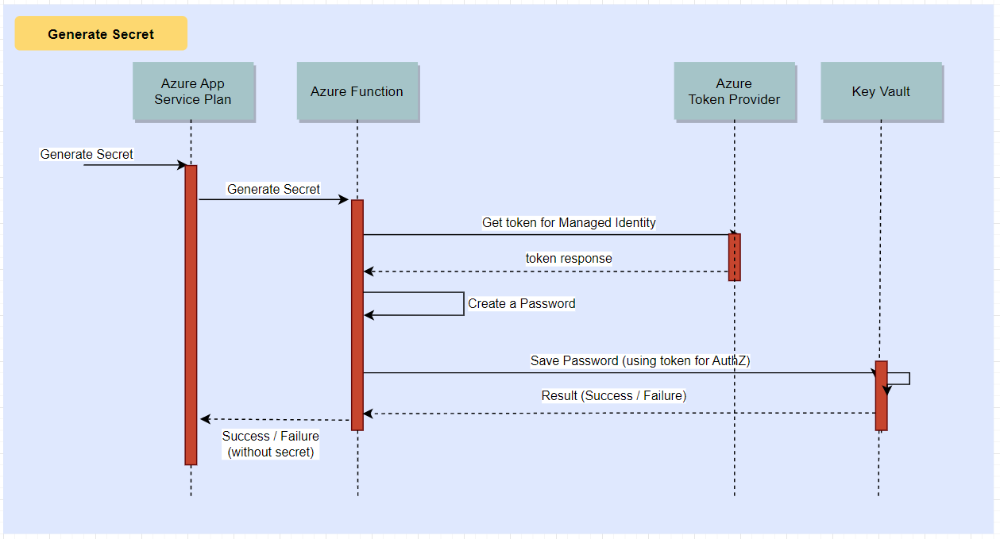
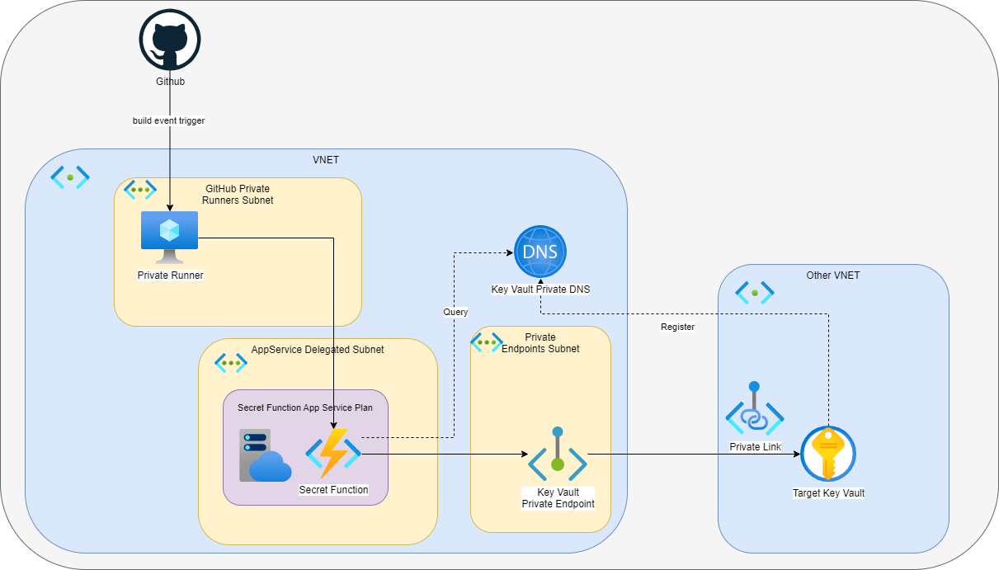

# Generating secrets with an Azure Function

- [Generating secrets with an Azure Function](#generating-secrets-with-an-azure-function)
  - [Introduction](#introduction)
  - [Create a local development environment with VS Code](#create-a-local-development-environment-with-vs-code)
  - [Create a 'Hello World' function](#create-a-hello-world-function)
  - [Build Out the Secrets Generator Function](#build-out-the-secrets-generator-function)
    - [Configure the Python Azure Library Dependencies](#configure-the-python-azure-library-dependencies)
    - [Update the Python Code](#update-the-python-code)
    - [Create the Azure resources](#create-the-azure-resources)
    - [Authenticate to Azure via the CLI and Test Locally](#authenticate-to-azure-via-the-cli-and-test-locally)
  - [Deploy to Azure](#deploy-to-azure)
  - [Security Improvements](#security-improvements)
    - [Use case: private GitHub runners](#use-case-private-github-runners)
  - [Clean up afterwards](#clean-up-afterwards)

## Introduction

Azure Key Vault provides some great capabilities in the secrets management domain. One missing feature
is the ability to generate a random secure password, like we are used to with password managers on our
mobile phones. This ability is beneficial from a security perspective as it avoids reuse of passwords
and can ensure they are sufficiently complicated.

In this blog I take a look at implementing an Azure Function to supplement the baseline Azure Key Vault.

What we are going to build is depicted simply by the following sequence diagram:




## Create a local development environment with VS Code

I am working with wsl2 on a Windows 10 laptop, I already had the following tools installed into my Ubuntu
wsl environment:

- Python (version 3.8.10) - accessed via `python3`
- Azure CLI (version 2.44.1)
- npm (version 6.14.4)

There are a number of additional tools you need to set up to work locally and the installation process is
described in detail in the [official documentation](https://learn.microsoft.com/en-us/azure/azure-functions/create-first-function-cli-python?pivots=python-mode-decorators&tabs=azure-cli%2Cbash) but in summary:

1. Set up a python virtual environment

```bash
python3 -m venv .venv
source .venv/bin/activate
```

2. Install Azure Functions Core Tools

```bash
curl https://packages.microsoft.com/keys/microsoft.asc | gpg --dearmor > microsoft.gpg
sudo mv microsoft.gpg /etc/apt/trusted.gpg.d/microsoft.gpg
sudo sh -c 'echo "deb [arch=amd64] https://packages.microsoft.com/repos/microsoft-ubuntu-$(lsb_release -cs)-prod $(lsb_release -cs) main" > /etc/apt/sources.list.d/dotnetdev.list'
sudo apt-get update
sudo apt-get install azure-functions-core-tools-4
```

3. Install the Azurite storage emulator (the docs state it requires npm version 8 or later but I
   had missed this and was using an earlier version, see [npm docs](https://docs.npmjs.com/)):

```bash
npm install -g azurite
```

## Create a 'Hello World' function

To get something working and check the plumbing I will create a simple 'Hello World' function.
Firstly, let's create a template function by executing the `func init` command:

```bash
func init SecretGeneratorFunc --python -m V2
```

The `init` command sets up a basic structure like this:

```bash
❯ tree
.
└── SecretGeneratorFunc
    ├── function_app.py
    ├── host.json
    ├── local.settings.json
    └── requirements.txt
```

Looking at the `function_app.py` source we see a simple function:

```python
import azure.functions as func

app = func.FunctionApp()

@app.function_name(name="HttpTrigger1")
@app.route(route="hello")                # HTTP Trigger
def test_function(req: func.HttpRequest) -> func.HttpResponse:
    return func.HttpResponse("HttpTrigger1 function processed a request!!!")
```

Let's try running it locally to see it in action. To do this we must first configure azurite by
updating `local.settings.json` setting: `"AzureWebJobsStorage": ""UseDevelopmentStorage=true"`
and then creating a directory for it e.g. `/home/$USER/azurite_storage` before running it in a separate
terminal:

```bash
azurite -s -l /home/$USER/azurite_storage -d /home/$USER/azurite_storage/debug.log
```

Now we can start the function by calling `func start` then in a separate window test it responds correctly:

```bash
❯ curl -s http://localhost:7071/api/hello
HttpTrigger1 function processed a request!!!%
```

## Build Out the Secrets Generator Function

We now have a working function but it does not do what we need it to. The next steps are:

- configure the python Azure library dependencies
- update the python code
- define the Azure Key Vault
- authenticate to Azure via the CLI and test locally

### Configure the Python Azure Library Dependencies

We will need the `azure-keyvault-secrets` and `azure-identity` libraries which we pull in via
the `requirements.txt` file which after updating should look like this:

```text
azure-functions
azure-keyvault-secrets 
azure-identity
```

to install these dependencies locally we then run:

```bash
pip3 install -r requirements.txt
```

### Update the Python Code

You can see the full source code for the function [here](./SecretGeneratorFunc/function_app.py) but
the key part is the following:

```python
def save_secret(key_vault_uri, name, secret_value):
    try:
        client = SecretClient(vault_url=key_vault_uri, credential=DefaultAzureCredential())
        client.set_secret(name, secret_value)
        logging.info(f"Saved Secret {name} to {key_vault_uri}/{name}")
        return json_response({"message": "Successfully added secret", "secretUri": f"{key_vault_uri}/{name}"}, 200)
    except (RuntimeError, Exception) as e:
        logging.error(f"Failed to save secret {e}")
        return json_response({"message": f"Failed to save secret {key_vault_uri}/{name}"}, 500)
```

Let's break this down a bit. The `save_secret` function takes the following parameters:

- `key_vault_uri` - the URI of the Azure Key Vault we want to save a secret to
- `name` - the name of the secret
- `secret_value` - the value of the secret generated by the `generate_secret` function:

```python
def generate_secret(size):
    alphabet = string.ascii_letters + string.digits
    password = ''.join(secrets.choice(alphabet) for _ in range(size))
    return password
```

The other interesting part is [`DefaultAzureCredential`](https://learn.microsoft.com/en-us/python/api/azure-identity/azure.identity.defaultazurecredential?view=azure-python)
which looks for a valid authentication token in the following order:

- Azure Managed Identity
- Azure CLI

As per the link it does check for other mechanisms too but these are the ones we are interested in. This
means that if we are running the function in Azure it will use the Managed Identity to authenticate and
when we run locally it can use the Azure CLI.

Finally, we have the decorators which define the function as an HTTP Trigger and the route:

```python
@app.function_name(name="HttpTrigger1")
@app.route(route="secrets")
def test_function(req: func.HttpRequest) -> func.HttpResponse:
```

In this case we want to use the path `/api/secrets` to trigger the function.

### Create the Azure resources

We first need some basic resources created via the Azure CLI:

```bash
# Resource group to contain our function and key vault
az group create --name SecretGeneratorFunc --location westeurope

# storage account to upload our function to (when we try this in Azure)
az storage account create --name secretgeneratorfunc --resource-group SecretGeneratorFunc --location westeurope --sku Standard_LRS

# Key Vault we will add secrets to
az keyvault create --name secretgeneratorfunc --resource-group SecretGeneratorFunc --location westeurope
```

### Authenticate to Azure via the CLI and Test Locally

We are now in a position to test the function locally. Firstly ensure you are logged in with Azure CLI.
You can then run the function locally:

```bash
# In terminal 1 
azurite -s -l /home/$USER/azurite_storage -d /home/$USER/azurite_storage/debug.log
# In a second terminal
func start
```

and in a third terminal we can test the function:

```bash
❯ curl -s http://localhost:7071/api/secrets -d '{"name": "test-secret", "vault": "secretgeneratorfunc", "length": 28}'
{"message": "Successfully added secret", "secretUri": "https://secretgeneratorfunc.vault.azure.net/test-secret"}
```

We can validate this has indeed worked by retrieving the secret from the Key Vault:

```bash
❯ az keyvault secret show --vault-name secretgeneratorfunc --name test-secret --query "value" -o tsv
cFKviWXlnePGDLJkfGefFY8f4eXS
```

We can also check the function logs where we see the following highlights:

```log
[2023-03-28T15:24:15.335Z] Executing 'Functions.HttpTrigger1' (Reason='This function was programmatically called via the host APIs.', Id=2736646e-0b3b-45c2-9d04-d6b85bb964bd)

[2023-03-28T15:24:15.381Z] SecretFunction: Received a request
[2023-03-28T15:24:15.381Z] SecretFunction: length = 28
[2023-03-28T15:24:15.381Z] SecretFunction: name = test-secret
[2023-03-28T15:24:15.381Z] ManagedIdentityCredential will use IMDS
[2023-03-28T15:24:15.381Z] No environment configuration found.
[2023-03-28T15:24:15.381Z] SecretFunction: vault = secretgeneratorfunc
[2023-03-28T15:24:15.539Z] No body was attached to the request
[2023-03-28T15:24:16.550Z] DefaultAzureCredential acquired a token from AzureCliCredential
[2023-03-28T15:24:16.550Z] Request URL: 'https://secretgeneratorfunc.vault.azure.net/secrets/test-secret?api-version=REDACTED'
[2023-03-28T15:24:16.668Z] Saved Secret test-secret to https://secretgeneratorfunc.vault.azure.net/test-secret

[2023-03-28T15:24:16.716Z] Executed 'Functions.HttpTrigger1' (Succeeded, Id=2736646e-0b3b-45c2-9d04-d6b85bb964bd, Duration=1397ms)
```

Note how the DefaultAzureCredential uses the Azure CLI to authenticate to Azure and the secret has been saved to `test-secret` in the Key Vault `secretgeneratorfunc`.

## Deploy to Azure

Now we have a the function working locally we can deploy it to Azure, To do so we first must create a `functionapp` we will call `SecretGeneratorFunc`:

```bash
# create a B1 SKU app service plan for the function using linux runtime
# (can use a simpler/cheaper one but I will need this later for vnet integration)
az appservice plan create --name SecretGeneratorAppPlan --resource-group SecretGeneratorFunc --location westeurope \
  --sku B1 --is-linux

# Create a functionapp using the app service plan 
az functionapp create  --runtime python --plan SecretGeneratorAppPlan --runtime-version 3.9 \
  --resource-group SecretGeneratorFunc --functions-version 4 --name SecretGeneratorFunc --os-type linux \
  --storage-account secretgeneratorfunc

# Define a SystemAssigned managed identity:
az functionapp identity assign --name SecretGeneratorFunc --resource-group SecretGeneratorFunc

# Grant the functionapp access to the Key Vault:
az keyvault set-policy --name secretgeneratorfunc --object-id "<principal ID from previous command>" \
   --secret-permissions get list set delete

# We must set a flag as we are using python and v2 of the Functions programming model
# (Note: without this flag your function calls will not work and you will get a confusing HTTP 404 response
az functionapp config appsettings set --name SecretGeneratorFunc --resource-group SecretGeneratorFunc \
   --settings AzureWebJobsFeatureFlags=EnableWorkerIndexing
```

We are now ready to deploy our python function code which is achieved with:

```bash
func azure functionapp publish SecretGeneratorFunc
```

We can now try the function for which we will need an API key which we can fetch from azure and save to `APIKEY` before using curl to call the API:

```bash
❯ APIKEY=$(az functionapp keys list -g "SecretGeneratorFunc" -n "SecretGeneratorFunc" --query "functionKeys.default" --output tsv)
❯ curl https://secretgeneratorfunc.azurewebsites.net/api/secrets -H "x-functions-key: $APIKEY" -d '{"name": "test-secret2", "vault": "secretgeneratorfunc", "length": 23}'
{"message": "Successfully added secret", "secretUri": "https://secretgeneratorfunc.vault.azure.net/test-secret2"}%
```

**Success!** Let's just validate that the secret is really there by retrieving it from the Key Vault:

```bash
> az keyvault secret show --vault-name secretgeneratorfunc --name test-secret2 --query "value" -o tsv
UNar4AtesX3VlnqA1YLlLkw
```

There are better ways to do this longer term (using terraform and github actions for example) but this is a quick way to get started.

## Security Improvements

Now everything is working lets turn off the public IP address of the key vault and instead connect using a private endpoint. This is a good idea as it means that the key vault is not exposed to the internet and can only be accessed from within the virtual network:


```bash
rg="SecretGeneratorFunc"
vnet="SecretGeneratorFuncVnet"
snetfunc="SecretGeneratorFuncSubnet"
snetpe="SecretGeneratorFuncKeyVaultSubnet"
func="SecretGeneratorFunc"
keyvault="secretgeneratorfunc"

# Create a virtual network
az network vnet create --resource-group $rg --name $vnet --address-prefixes "10.0.0.0/16" \
  --subnet-name $snetfunc --subnet-prefix "10.0.1.0/24"

# associate the functionapp with the virtual network
az functionapp vnet-integration add --resource-group  $rg --name $func --vnet $vnet --subnet $snetfunc
   
# add a subnet to drop the private endpoint into
az network vnet subnet create --resource-group  $rg --vnet-name $vnet --name $snetpe --address-prefixes "10.0.2.0/24"

# Add private DNS for the private endpoint 
az network private-dns zone create --resource-group $rg --name "privatelink.vaultcore.azure.net"

# link to the VNET
az network private-dns link vnet create --resource-group $rg \
   --zone-name "privatelink.vaultcore.azure.net" --name $keyvault-PrivateEndpoint \
   --virtual-network $vnet --registration-enabled false

# add a private endpoint to the key vault in the virtual network
az network private-endpoint create --connection-name "$keyvault-akv-pe" \
    --resource-group  $rg --name KeyVaultPrivateEndpoint --vnet-name $vnet --subnet $snetpe \
    --private-connection-resource-id $(az keyvault show --name $keyvault --query id -o tsv) \
     --group-ids vault

# integrate the private dns zone and the private endpoint
az network private-endpoint dns-zone-group create \
    --resource-group $rg \
    --endpoint-name KeyVaultPrivateEndpoint \
    --name AkvDnsZoneGroup \
    --private-dns-zone "privatelink.vaultcore.azure.net" \
    --zone-name vaultcore

# disable public access to the vault
az keyvault update --name $keyvault --resource-group $rg --public-network-access disabled
```

### Use case: private GitHub runners

We can now use the private endpoint to access the key vault from a private GitHub runner. This is useful if you want to use GitHub actions to deploy your applications and infrastructure to Azure.

To do this you need to create a virtual machine in the same virtual network as the functionapp and key vault and then install the GitHub runner on the VM. After you register the GitHub runner it will await build events and run you GitHub actions.

The following diagram pulls this together and shows how you could generate a secret automatically as part of 
a deployment process using Github actions:



## Clean up afterwards

We can clean up all our resources with the following command:

```bash
az group delete --name SecretGeneratorFunc
```